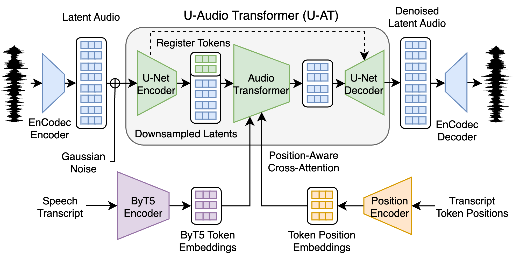
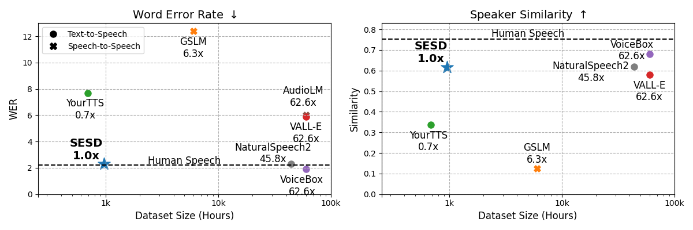

# Sample-Efficient Diffusion for Text-To-Speech Synthesis

This repository contains the implementation for SESD, a latent diffusion model for text-to-speech generation. We introduced this model in the following work:

**Sample-Efficient Diffusion for Text-To-Speech Synthesis**  
Justin Lovelace, Soham Ray, Kwangyoun Kim, Kilian Q. Weinberger, Felix Wu  
Interspeech 2024  
[\[paper\]](https://www.arxiv.org/abs/2409.03717)

## Abstract

This work introduces Sample-Efficient Speech Diffusion (SESD), an algorithm for effective speech synthesis in modest data regimes through latent diffusion. It is based on a novel diffusion architecture, that we call U-Audio Transformer (U-AT), that efficiently scales to long sequences and operates in the latent space of a pre-trained audio autoencoder. Conditioned on character-aware language model representations, SESD achieves impressive results despite training on less than 1k hours of speech – far less than current state-of-the-art systems. In fact, it synthesizes more intelligible speech than the state-of-the-art auto-regressive model, VALL-E, while using less than 2% the training data.

<div align="center" style="background: white; padding: 20px; color: black;">
  
  <br>
  <em style="color: black;">Overview of our Sample-Efficient Speech Diffusion (SESD) architecture.</em>
  <br><br>
  
</div>

If you find this work useful, please consider citing:

```bibtex
@inproceedings{lovelace2024sample,
  title={Sample-Efficient Diffusion for Text-To-Speech Synthesis},
  author={Lovelace, Justin and Ray, Soham and Kim, Kwangyoun and Weinberger, Kilian Q and Wu, Felix},
  booktitle={Proc. Interspeech 2024},
  pages={4403--4407},
  year={2024}
}
```

## Installation

Install the required dependencies:
```bash
pip install -r requirements.txt
```

## Datasets

We train and evaluate our models using the LibriSpeech dataset from the Hugging Face Hub and use the standard LibriSpeech dataset for evaluation.

### Speaker Prompt Data

For speaker-prompted generation, we utilize three seconds of another prompt. To extract the corresponding transcript for the speech, we utilized the [Montreal Forced Aligner](https://montreal-forced-aligner.readthedocs.io/en/latest/first_steps/example.html#example-1-aligning-librispeech-english). An aligned version of LibriSpeech can be found at:

```bash
data/aligned_librispeech.tar.gz
```

After extracting the archive, update the `ALIGNED_DATA_DIR` path in `audio_datasets/constants.py` to point to your data directory.

## Training

Our training setup:
- Single Nvidia A6000 GPU
- BF16 mixed precision training
- Batch size and other parameters may need adjustment based on your hardware

To train the diffusion model:
```bash
./scripts/train/train.sh
```

## Model Checkpoint

Model checkpoint will be released soon!

## Inference

To synthesize speech for the LibriSpeech test-clean set:
```bash
./scripts/sample/sample_16_ls_testclean.sh
```

Note: Update the `--resume_dir` argument with the path to your trained model.

## Questions and Support

Feel free to create an issue if you have any questions.

## Acknowledgements

This work built upon excellent open-source implementations from [Phil Wang (Lucidrains)](https://github.com/lucidrains). Specifically, we built off of his PyTorch [DDPM implementation](https://github.com/lucidrains/denoising-diffusion-pytorch).